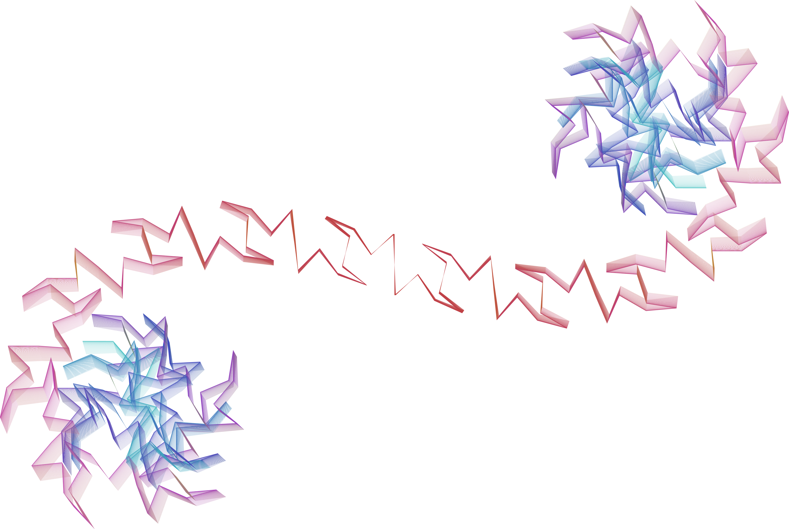

# turtle stuff

Just playing around with some stuff I saw on [computerphile](https://t.co/pPl0jII9Ee). This is written as a test suite so that it regenerates the images every time I save in my IDE. That means I get instant feedback, which makes me happy.

